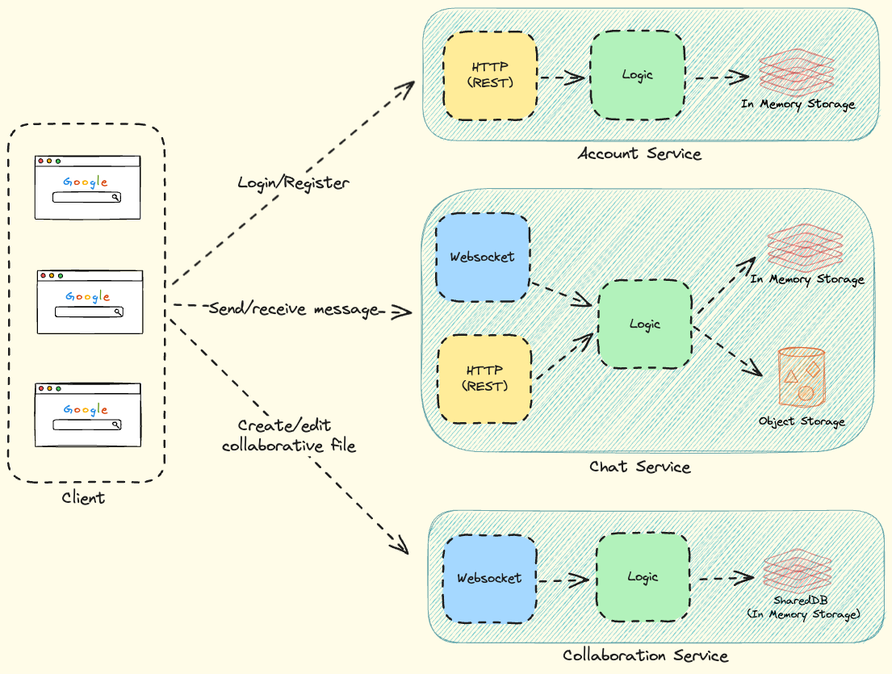
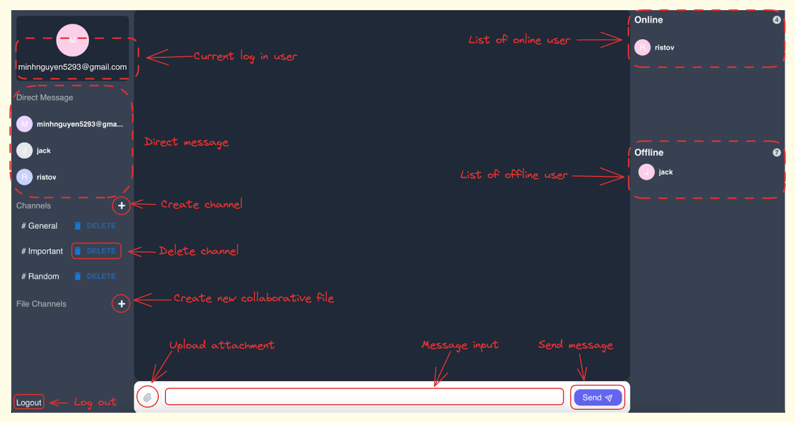

## A collaboration tool for messaging and collaborative document (WebSocket and ShareDB)

### System Architecture


### The system will have 4 main components
- Client: A web-based application (React) runs on the client’s browser.
- Account Service: Handle user’s authentication information.
- Chat Service: Handle all chat-related functions and support 2 protocols.
    - Websocket: used for real-time communication (direct/group messages)
    - HTTP (REST): used for other features like attachments (upload, download file)
- Collaboration Service: Handle the creation and editing of collaborative text documents.




### Installation

#### Using Docker Compose
`docker-compose up -d`

Client interface will be available at http://localhost:3000/

#### Using Local Setup
Each service can be manually start by these commands.
1. Client (./aalto-collaboration-tool-client)
`npm install && npm run start`


2. Account Service (./aalto-collaboration-tool-conversation/AccountService)
```
pip install -r requirements.txt && uvicorn main:app --port 8001
```


3. Message Service (./aalto-collaboration-tool-conversation/MessageService)
```
pip install -r requirements.txt && uvicorn main:app --port 8000
```


4. Colab Tool (./aalto-collaboration-tool-conversation/ColabTool)
`npm install && npm run start`

